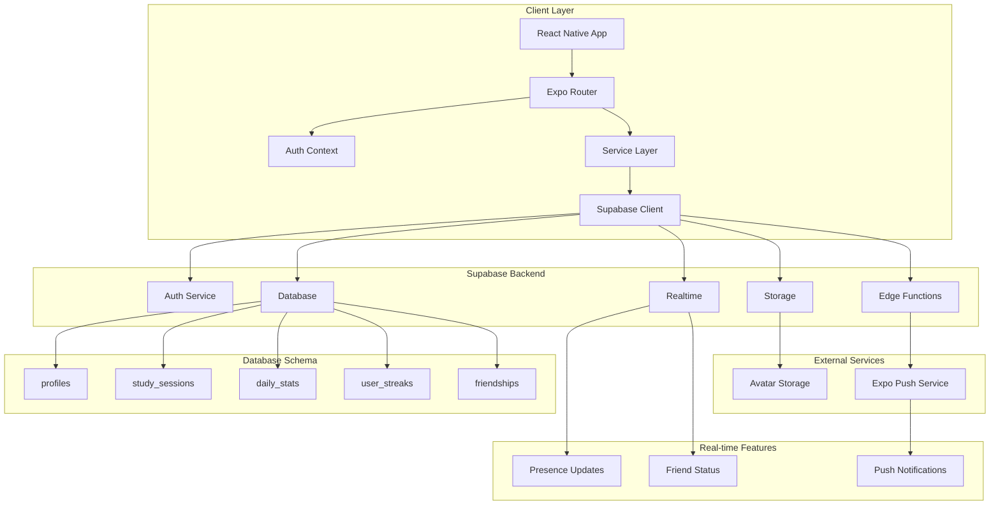

# Slakr AI - Architecture Overview

## System Architecture

Slakr AI is a React Native study companion app built with Expo, featuring real-time presence tracking, study session management, and social features. The architecture follows a modern full-stack pattern with Supabase as the backend-as-a-service.

### Tech Stack

**Frontend:**

- React Native 0.79.5 with Expo SDK 53
- TypeScript for type safety
- Expo Router for file-based navigation
- React Navigation for complex navigation patterns
- Expo Vector Icons for UI icons

**Backend:**

- Supabase (PostgreSQL + Auth + Realtime + Storage)
- Supabase Edge Functions for serverless compute
- Row Level Security (RLS) for data protection

**Infrastructure:**

- EAS Build for app distribution
- Expo Push Notifications for real-time alerts
- Cross-platform storage (AsyncStorage + Web Storage)

## Architecture Diagram



## Core Components

### 1. Authentication Flow

- **AuthContext**: Centralized auth state management
- **AuthGuard**: Route protection and redirect logic
- **Session Validation**: Proactive session health monitoring
- **Password Reset**: Deep link handling for email verification

### 2. Navigation Structure

```
app/
├── (auth)/          # Unauthenticated routes
│   ├── login.tsx
│   ├── register.tsx
│   └── reset-password.tsx
├── (tabs)/          # Landing page (unauthenticated)
│   ├── index.tsx    # Marketing/onboarding
│   └── explore.tsx
└── (main)/          # Authenticated app
    ├── index.tsx    # Home dashboard
    ├── streaks.tsx  # Streak tracking
    ├── friends.tsx  # Social features
    ├── profile.tsx  # User profile
    └── settings.tsx # App settings
```

### 3. Service Layer Architecture

- **SessionService**: Study session lifecycle management
- **StreakService**: Streak calculation and persistence
- **DailyStatsService**: Daily study time aggregation
- **PresenceService**: Real-time online status tracking
- **FriendsService**: Social relationship management
- **PushNotificationService**: Cross-platform notifications
- **StorageService**: File upload and management

### 4. Database Design

**Core Tables:**

- `profiles`: User information and presence status
- `study_sessions`: Individual study session records
- `daily_stats`: Aggregated daily study metrics
- `user_streaks`: Streak calculations and totals
- `friendships`: Social connections with status tracking

**Key Features:**

- Row Level Security (RLS) on all tables
- Optimistic locking for streak updates
- Retry logic for race condition handling
- Real-time subscriptions for presence updates

## Data Flow Patterns

### 1. Study Session Flow

```
User starts timer → SessionService.createActiveSession()
User completes session → SessionService.completeSession()
→ DailyStatsService.updateDailyStats()
→ StreakService.updateUserStreaks()
→ PresenceService.updateStatus()
```

### 2. Real-time Presence Flow

```
User comes online → PresenceService.setStatus('online')
→ Database trigger → Edge Function
→ Push notifications to friends
→ Realtime subscription updates
```

### 3. Authentication Flow

```
App launch → AuthContext.initializeAuth()
→ Check stored session → Validate with Supabase
→ Redirect based on auth state
→ Initialize services (presence, push notifications)
```

## Security Architecture

### 1. Authentication

- JWT-based authentication via Supabase Auth
- Automatic token refresh and session persistence
- Deep link handling for password reset flows

### 2. Authorization

- Row Level Security (RLS) policies on all tables
- User-scoped data access patterns
- Friend relationship validation for social features

### 3. Data Protection

- Encrypted storage for sensitive data
- Secure file upload with signed URLs
- Input validation and sanitization

## Performance Optimizations

### 1. Database Performance

- Strategic indexing on frequently queried columns
- Optimistic locking to prevent race conditions
- Retry logic with exponential backoff
- Connection pooling via Supabase

### 2. Client Performance

- Lazy loading of components and screens
- Efficient re-rendering with React hooks
- Image optimization with Expo Image
- Background task management for presence updates

### 3. Network Optimization

- Request batching where possible
- Offline-first data patterns
- Efficient real-time subscription management
- Push notification optimization

## Scalability Considerations

### 1. Database Scaling

- Partitioning strategy for daily_stats table
- Read replicas for analytics queries
- Connection pooling and query optimization

### 2. Real-time Scaling

- Presence service optimization for high concurrency
- Push notification rate limiting
- Edge function scaling for background tasks

### 3. Client Scaling

- Code splitting and lazy loading
- Efficient state management patterns
- Memory leak prevention in long-running sessions

## Monitoring and Observability

### 1. Error Tracking

- Comprehensive error logging in services
- Network error handling and retry logic
- Session validation and recovery mechanisms

### 2. Performance Monitoring

- Database query performance tracking
- Real-time connection health monitoring
- Push notification delivery tracking

### 3. User Analytics

- Study session duration tracking
- Streak progression monitoring
- Social engagement metrics

## Development Workflow

### 1. Local Development

- Expo development server with hot reloading
- Supabase local development setup
- TypeScript strict mode for type safety

### 2. Testing Strategy

- Unit tests for service layer functions
- Integration tests for database operations
- E2E tests for critical user flows

### 3. Deployment Pipeline

- EAS Build for iOS and Android
- Supabase migrations for schema changes
- Edge function deployment for serverless features

## Future Architecture Considerations

### 1. Microservices Migration

- Extract streak calculation to dedicated service
- Separate presence service for better scaling
- Independent notification service

### 2. Caching Strategy

- Redis for session data caching
- CDN for static assets and avatars
- Client-side caching for offline support

### 3. Analytics Platform

- Dedicated analytics service
- Real-time dashboard for user metrics
- A/B testing framework integration
